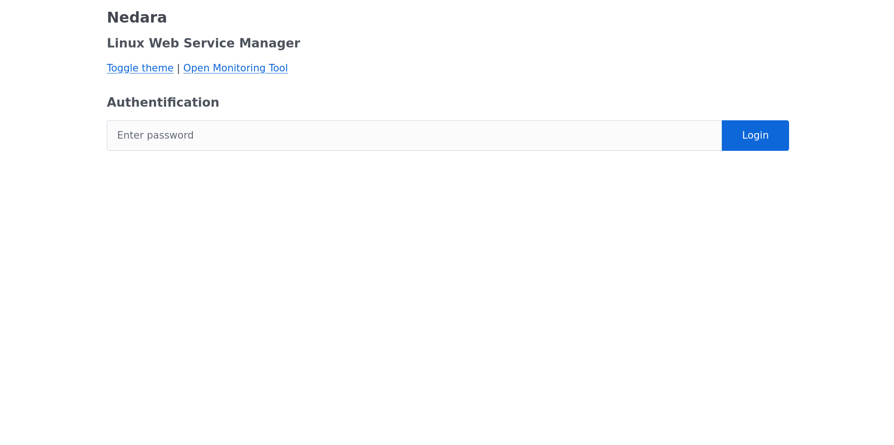
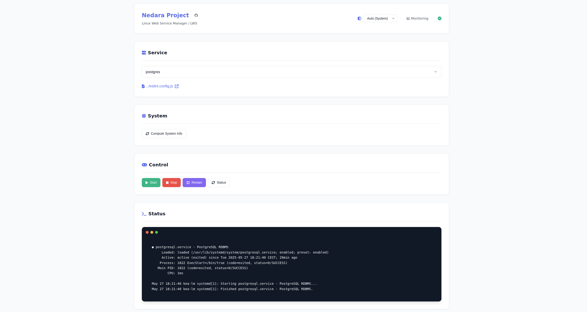

# Nedara LWS - Linux Web Service Manager

**Nedara LWS** is a lightweight and secure web interface to remotely manage Linux services (start, stop, status) via a simple and customizable UI. It is designed for server administrators and developers who want a centralized control panel for their systemd services.

---

## 🚀 Features

- Start, stop, and check the status of Linux services
- Simple password-based authentication (encrypted with Fernet)
- Lightweight and easy to deploy with Flask + Gunicorn (optional but recommended)
- Easily extensible with a `config.json` to define your services

---

## ⚙️ Requirements

- Python 3.7+
- Flask
- Gunicorn (for production deployment - optional but recommended)
- `sudo` and `systemctl` installed on the server
- A dedicated Linux user with passwordless sudo access

---

## 🔧 Configuration

### 1. Install Dependencies

You can use a virtual environment (optional but recommended):

```bash
python3 -m venv venv  # alternatively use virtualenvwrapper
source venv/bin/activate
pip install flask gunicorn cryptography psutil
```

---

### 2. Create `config.json`

Define the list of services you want to manage:

```json
{
  "services": {
    "My App": "myapp.service",
    "Database": "postgresql.service"
  }
}
```

---

### 3. Set up your Encryption Key & Token

In the Python file (`app.py`), set:

```python
KEY = b'your_generated_fernet_key'
TOKEN_APP = b'your_encrypted_password_token'
```

You can generate them with:

```python
from cryptography.fernet import Fernet
key = Fernet.generate_key()
print("KEY =", key)

token = Fernet(key).encrypt('YOUR_PASSWORD'.encode())
print("TOKEN_APP =", token)
```

---

### 4. Create a Dedicated User (`nedarasudo`)

To ensure safe and isolated execution of commands:

```bash
sudo adduser nedarasudo
sudo usermod -aG sudo nedarasudo
sudo visudo
```

And add the following line in visudo:

```
nedarasudo ALL=(ALL:ALL) NOPASSWD:ALL
```

Then, make sure the Flask app runs under this user.

---

## 🚀 Run in Production with Gunicorn

Create a systemd service unit (example):

```ini
[Unit]
Description=Linux Web Service Manager (gunicorn)
After=network.target

[Service]
User=flasksudo
WorkingDirectory=/home/your_user/nedara-lws/
Environment="PATH=/home/your_user/.virtualenvs/yourenv/bin"
ExecStart=/home/your_user/.virtualenvs/yourenv/bin/gunicorn -b 0.0.0.0:8000 -w 1 app:app

[Install]
WantedBy=multi-user.target
```

Enable and start the service:

```bash
sudo systemctl enable nedara-lws.service
sudo systemctl start nedara-lws.service
```

---

## 🌐 (Optional) Reverse Proxy with Nginx

Using Nginx as a reverse proxy improves performance and security. Very basic example (HTTP):

```nginx
server {
    listen 80;
    server_name yourdomain.com;

    location / {
        proxy_pass http://127.0.0.1:8000;
        proxy_set_header Host $host;
        proxy_set_header X-Real-IP $remote_addr;
    }
}
```

Reload Nginx:

```bash
sudo systemctl reload nginx
```

---

## 🔐 Authentication

Authentication is handled via encrypted tokens using the Fernet symmetric encryption system. A session ID is returned upon successful login, and must be included in future requests.

---

## 📁 Project Structure

```
.
├── app.py                # Main Flask application
├── config.json           # Service definitions
├── templates/
│   └── index.html        # Web interface
├── static/               # CSS / JS if needed
```

---

## 🧪 Development

```bash
export FLASK_APP=app.py
flask run
```

Or directly:

```bash
python3 app.py
```

---

## 📝 License

This project is open-source under the [MIT License](LICENSE).

---

## 💬 Suggestions

- Use HTTPS in production (with Nginx + Let's Encrypt)
- Restrict access by IP or VPN
- Consider integrating LDAP or OAuth in future releases

---

**Made with ❤️ by the [Nedara Project](https://github.com/Nedara-Project)**
## Screenshots




