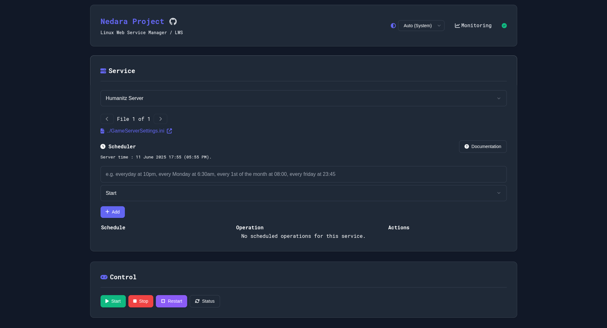

# Nedara LWS - Linux Web Service Manager

**Nedara LWS** is a lightweight and secure web interface to remotely manage Linux services (start, stop, status) via a simple and customizable UI. It is designed for server administrators and developers who want a centralized control panel for their systemd services.



---

## 🚀 Features

- Start, stop, restart and check the status of Linux services
- Real-time updates via WebSocket (Socket.IO)
- Scheduler for service management
- Simple password-based authentication (encrypted with Fernet)
- Lightweight and easy to deploy with Flask
- Easily extensible with a `config.json` to define your services (use `config.json.example` template)
- Edit files directly from the Monaco Editor (for your configuration files, etc.)

---

## ⚙️ Requirements

- Python 3.7+
- Flask
- Socket.IO for real-time communication
- `sudo` and `systemctl` installed on the server
- A dedicated Linux user with passwordless sudo access
- SQLite database (`apt install sqlite3`)

---

## 🔧 Configuration

### 1. Install Dependencies

You can use a virtual environment (optional but recommended):

```bash
python3 -m venv venv  # alternatively use virtualenvwrapper
source venv/bin/activate
pip install flask cryptography psutil python-socketio gevent gevent-websocket
```

Alternatively you can use `gunicorn` - do not forget to `pip install gunicorn` then.

---

### 2. Create `config.json`

Define the list of services you want to manage (and potentially any config files — mandatory for each service):

```json
{
  "services": {
    "My App": "myapp.service",
    "Database": "postgresql.service"
  },
  "service_files": {
    "My App": "",
    "Database": [
      "/path/to/your/file",
      "/path/to/your/file2"
    ]
  }
}
```

---

### 3. Set up your Encryption Key & Token

Your configuration is now stored in `config.json`.

Add the following fields:

```json
{
  "fernet_key": "your_generated_fernet_key",
  "token_app": "your_encrypted_password_token"
}
```

#### 🔐 Generate the Fernet key and encrypted token in Python:

```python
from cryptography.fernet import Fernet

# Generate a new Fernet key (keep it safe!)
key = Fernet.generate_key()
print("fernet_key =", key.decode())  # Copy this value to "fernet_key" in config.json

# Encrypt your application password
fernet = Fernet(key)
token = fernet.encrypt(b'YOUR_PASSWORD')
print("token_app =", token.decode())  # Copy this value to "token_app" in config.json
```

#### 📝 Example `config.json` result:

```json
{
  "port": 5000,
  "secret_key": "your_secret_key_here",
  "debug": false,
  "monitoring_url": "http://localhost:5001/monitoring",
  "disable_system_info": true,
  "fernet_key": "YHgy3YkxuXQbaN9bWZ_VBz8ARgN-KgMTt70qBkO9xoI=...example",
  "token_app": "gAAAAABkUrpK3kV...example",
  "services": {
    "nginx": "nginx.service",
    "postgres": "postgresql.service"
  },
  "service_files": {
      "nginx": "",
      "postgres": [
          "/path/to/your/file",
          "/path/to/your/file2"
      ]
  }
}
```

> 🛠️ Copy `config.example.json` to `config.json` and fill in your own keys and settings.

> ✅ Make sure `fernet_key` and `token_app` are both strings, **base64-encoded**.

---

### 4. Create a Dedicated User (`nedarasudo`)

To ensure safe and isolated execution of commands:

```bash
sudo adduser nedarasudo
sudo usermod -aG sudo nedarasudo
sudo visudo
```

And add the following line in visudo:

```
nedarasudo ALL=(ALL:ALL) NOPASSWD:ALL
```

Then, make sure the Flask app runs under this user.

---

## 🚀 Run in Production

For production environments, you can launch `app.py` directly via Python or use Gunicorn (or any WSGI).

Create a systemd service unit (example):

```ini
[Unit]
Description=Nedara LWS - Linux Web Service Manager
After=network.target

[Service]
User=nedarasudo
WorkingDirectory=/home/your_user/nedara-lws/
Environment="PATH=/home/your_user/.virtualenvs/YOURENV/bin"
ExecStart=/home/your_user/.virtualenvs/YOURENV/bin/python3 app.py

# Example for Gunicorn - not required
#ExecStart=/home/your_user/.virtualenvs/YOURENV/bin/gunicorn -k gevent -b 0.0.0.0:8000 -w 1 app:app

[Install]
WantedBy=multi-user.target
```

Enable and start the service:

```bash
sudo systemctl enable nedara-lws.service
sudo systemctl start nedara-lws.service
```

---

## 🌐 (Optional) Reverse Proxy with Nginx

Using Nginx as a reverse proxy improves performance and security. Very basic example (HTTP):

```nginx
server {
    listen 80;
    server_name yourdomain.com;

    location / {
        proxy_pass http://127.0.0.1:8000;
        proxy_set_header Host $host;
        proxy_set_header X-Real-IP $remote_addr;

        # WebSocket support for Socket.IO
        proxy_http_version 1.1;
        proxy_set_header Upgrade $http_upgrade;
        proxy_set_header Connection "upgrade";
    }
}
```

Reload Nginx:

```bash
sudo systemctl reload nginx
```

---

## 🔐 Authentication

Authentication is handled via encrypted tokens using the Fernet symmetric encryption system. A session ID is returned upon successful login, and must be included in future requests.

---

## 🌐 Real-time Communication

The application uses Socket.IO for real-time communication between the server and clients.

---

## 📁 Project Structure

```
.
├── app.py                # Main Flask application
├── config.json           # Service definitions
├── templates/
│   └── index.html        # Web interface
├── static/               # CSS / JS if needed
```

---

## 🧪 Development

```bash
export FLASK_APP=app.py
flask run
```

Or directly:

```bash
python3 app.py
```

---

## 📝 License

This project is open-source under the [MIT License](LICENSE).

---

## 💬 Suggestions

- Use HTTPS in production (with Nginx + Let's Encrypt)
- Restrict access by IP or VPN

---

**Made with ❤️ by the [Nedara Project](https://github.com/Nedara-Project)**
